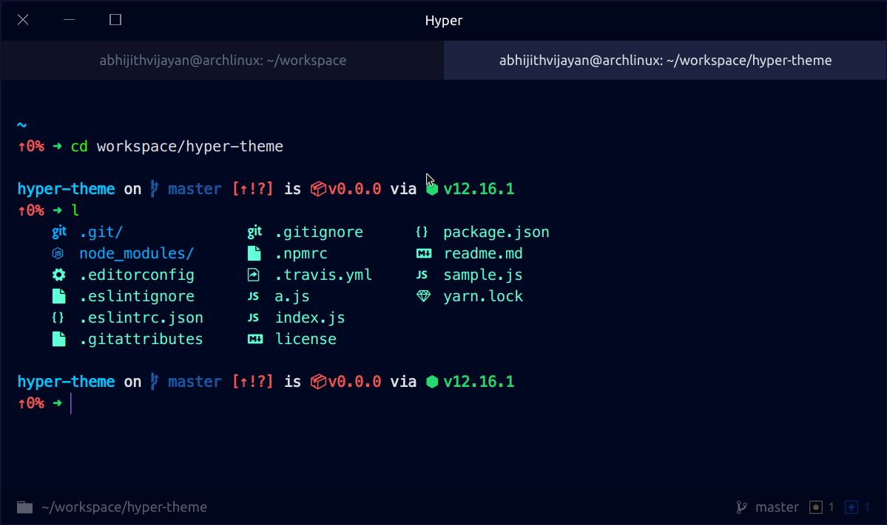

<h1 align="center">hyper-atlantic-night-owl</h1>

hyper-atlantic-night-owl is a beautiful and elegant theme for the <a target="_blank" href="https://hyper.is/">Hyper terminal</a>

 
	
  

<h3 align="center">🙋‍♂️ Made by <a href="https://twitter.com/_abhijithv">@abhijithvijayan</a></h3>

  Donate:
  <a href="https://www.paypal.me/iamabhijithvijayan" target='_blank'><i><b>PayPal</b></i></a>,
  <a href="https://www.patreon.com/abhijithvijayan" target='_blank'><i><b>Patreon</b></i></a>

  

## 🛠 Install

###### Hyper's built-in CLI (hyper)

1.  `hyper i hyper-atlantic-night-owl`
1.  Enjoy hyper-atlantic-night-owl.

###### Manually

1.  Open `~/.hyper.js` in your favorite editor.
1.  Add `hyper-atlantic-night-owl` to the `plugins` array.
1.  Enjoy hyper-atlantic-night-owl.

## ⚙️ Configure

By default, hyper-atlantic-night-owl aims to deliver a beautiful experience out of the box.

However, if you'd like to customize like in the screenshot, I recommend checking out [my setup](https://github.com/abhijithvijayan/dotfiles#hyper).

## License

MIT © [Abhijith Vijayan](https://abhijithvijayan.in)
